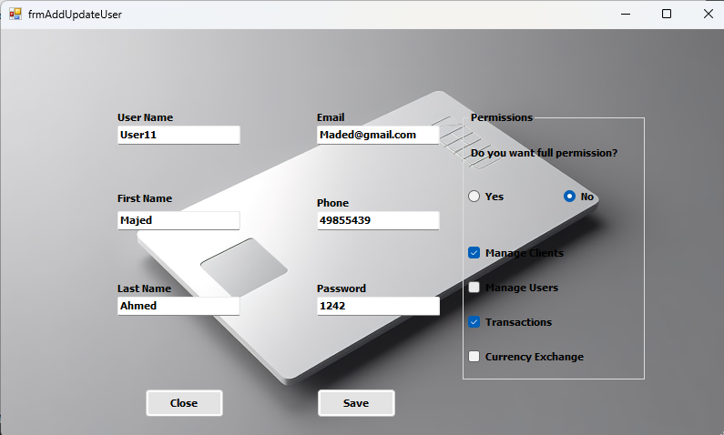
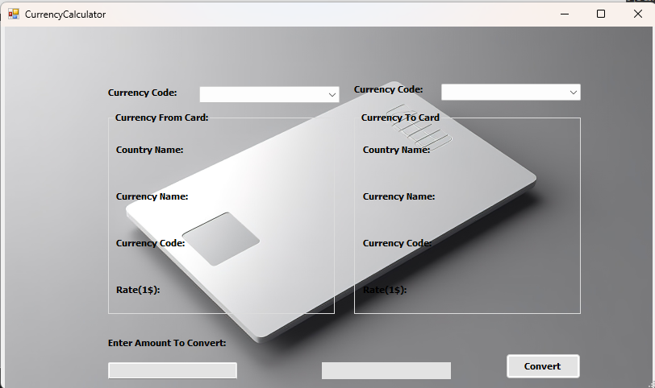
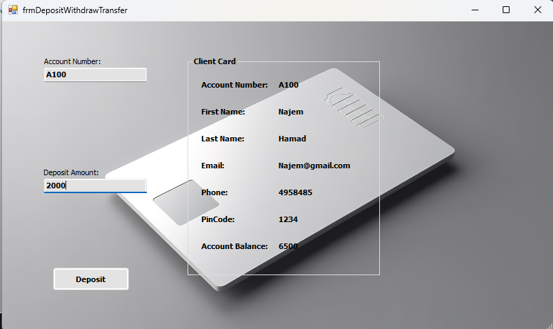
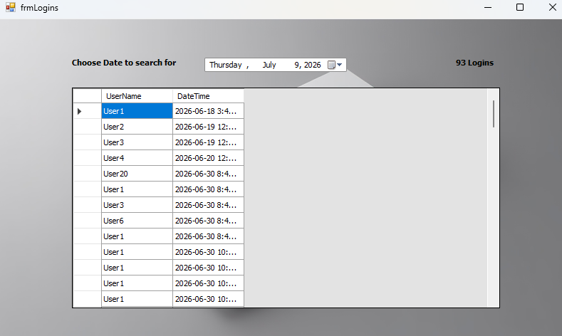
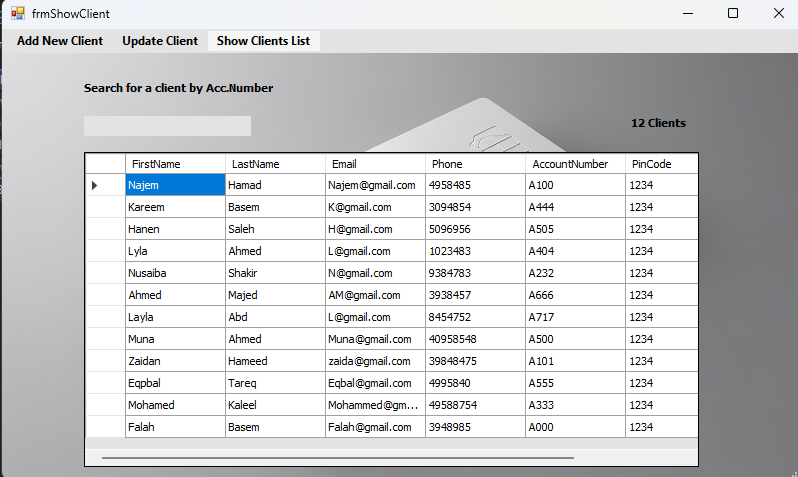
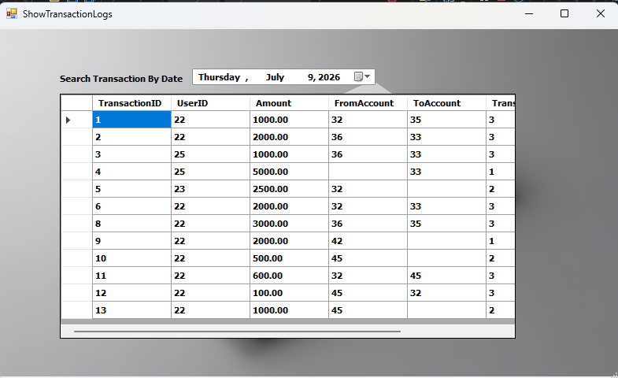

# Bank-Management-System
## A desktop banking management system bult with C# and Windows Form ,using SQL Server as the database.
## Features
- User Authentication.
- Client Management.
- User Management.
- Register all Logins including Login date.
- Filter Logins by date.
- Withdraw and Deposit.
- Money Transfer.
- Record all Transactions including the Transaction date.
- Filter Transaction by Date.
- View Available Currencies and update rate.
- Convert Currency.
## Technologies Used
- C#.
- Windows Forms.
- ADO.NET.
- SQL Server.
- Object-Oriented Programming (OOP).
- Three-Layer Architecture.
## Screenshots
 
 
 
 
 
 
 ## Program Structure
 ```
Bank Management System
│
├── BankSystem_PresentationLayer-contains the Windows Form user interface.
├── BankSystem_BusinessLayer-contains the Business Logic .
├── BankSystem_DataAccessLayer-handles database operation using ADO.NET.
├── Database-contains the SQL Server datatbase creation script (BankSystem.sql).
├── Screenshots-contains screenshot of the application.
└── README.md-provide documentaion and instructions for the project.
 ```
## How To Run
-Create the database using (Database\BankSystem.sql).
- Update the SQL Server connection string.
- Open the solution in Visual Studio.
- Build and run the project.


  


  

